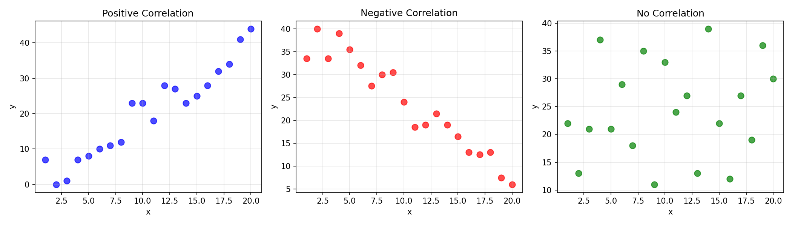

# Section2: 折れ線グラフと散布図 - 技術説明

## 🎯 このセクションで学ぶこと

折れ線グラフと散布図の詳細なカスタマイズ方法を学びます。
線のスタイル、マーカー、色、透明度などを自在に操れるようになります。

---

## 1. 折れ線グラフの詳細オプション

### 線のスタイル

`linestyle` パラメータで線の種類を変更できます。
実線、破線、点線、一点鎖線など、用途に応じて使い分けます。


```
【線のスタイル一覧】

┌───────────┬───────────────────────────────────────────────┐
│ スタイル  │ 説明                                          │
├───────────┼───────────────────────────────────────────────┤
│ '-'       │ 実線（デフォルト）                            │
│ '--'      │ 破線（dashed）                                │
│ ':'       │ 点線（dotted）                                │
│ '-.'      │ 一点鎖線（dash-dot）                          │
└───────────┴───────────────────────────────────────────────┘
```

```python
import matplotlib.pyplot as plt

x = [1, 2, 3, 4, 5]
y = [10, 20, 15, 25, 20]

# 線のスタイルを指定
plt.plot(x, y, linestyle='--')  # 破線

# 短縮形も可能
plt.plot(x, y, '--')

plt.show()
```

### マーカーの種類

```
【マーカー一覧】

  'o' 丸      's' 四角     '^' 三角上    'v' 三角下    'D' ダイヤ
    ●            ■            ▲            ▼            ◆

  '*' 星      '+' プラス   'x' バツ      '.' 点        '|' 縦線
    ★            +            ×            ・            │
```

```python
import matplotlib.pyplot as plt

x = [1, 2, 3, 4, 5]
y = [10, 20, 15, 25, 20]

# マーカーを指定
plt.plot(x, y, marker='o')  # 丸マーカー

# マーカーのサイズ
plt.plot(x, y, marker='o', markersize=10)

plt.show()
```

### 線の色と太さ

```
【色の指定方法】

  1. 色名: 'red', 'blue', 'green', 'orange', 'purple', ...
  2. 短縮形: 'r', 'b', 'g', 'c', 'm', 'y', 'k', 'w'
  3. 16進数: '#FF0000', '#00FF00', '#0000FF'
  4. RGB: (1.0, 0.0, 0.0)

┌───────┬────────────────┐
│ 短縮形│ 色             │
├───────┼────────────────┤
│  'r'  │ 赤 (red)       │
│  'g'  │ 緑 (green)     │
│  'b'  │ 青 (blue)      │
│  'c'  │ シアン (cyan)  │
│  'm'  │ マゼンタ       │
│  'y'  │ 黄 (yellow)    │
│  'k'  │ 黒 (black)     │
│  'w'  │ 白 (white)     │
└───────┴────────────────┘
```

```python
import matplotlib.pyplot as plt

x = [1, 2, 3, 4, 5]
y = [10, 20, 15, 25, 20]

# 色と太さを指定
plt.plot(x, y, color='red', linewidth=2)

# 短縮形
plt.plot(x, y, 'r-', linewidth=2)

plt.show()
```

### フォーマット文字列（短縮形）

```
【フォーマット文字列】

  plt.plot(x, y, 'ro--')
                  │││
                  ││└── 線のスタイル（--）
                  │└─── マーカー（o）
                  └──── 色（r = red）

  例:
  'b-'    : 青の実線
  'r--'   : 赤の破線
  'go'    : 緑の丸マーカー（線なし）
  'k^-'   : 黒の三角マーカー + 実線
  'c*--'  : シアンの星マーカー + 破線
```

```python
import matplotlib.pyplot as plt

x = [1, 2, 3, 4, 5]
y1 = [10, 20, 15, 25, 20]
y2 = [8, 18, 12, 22, 18]

# フォーマット文字列で一括指定
plt.plot(x, y1, 'ro-')   # 赤・丸・実線
plt.plot(x, y2, 'bs--')  # 青・四角・破線

plt.show()
```

---

## 2. 複数の線を描き分ける

### 視覚的に区別しやすいグラフ

```
【複数線の区別方法】

      ^
  100 |     *────*  ━━━ 2024年（赤・実線）
      |    / \
   80 |   *   *
      |  /     \    ─ ─ 2023年（青・破線）
   60 | □       □
      |/         \  ····· 2022年（緑・点線）
   40 △           △
      +──────────────────→
       1   2   3   4   5

  色・線種・マーカーを組み合わせて区別
```

```python
import matplotlib.pyplot as plt

x = [1, 2, 3, 4, 5]
y2022 = [40, 50, 45, 55, 48]
y2023 = [50, 60, 55, 65, 58]
y2024 = [60, 80, 70, 90, 75]

plt.figure(figsize=(10, 6))

# 色・マーカー・線種を変えて区別
plt.plot(x, y2022, 'g:^', label='2022', linewidth=2, markersize=8)   # 緑・点線・三角
plt.plot(x, y2023, 'b--s', label='2023', linewidth=2, markersize=8)  # 青・破線・四角
plt.plot(x, y2024, 'r-o', label='2024', linewidth=2, markersize=8)   # 赤・実線・丸

plt.legend()
plt.title("Yearly Comparison")
plt.xlabel("Month")
plt.ylabel("Value")
plt.grid(True, alpha=0.3)

plt.show()
```

---

## 3. 散布図（Scatter Plot）

### scatter() の基本

散布図は 2 つの変数の「関係性」を可視化するのに適しています。
各点がデータ 1 件を表し、全体の分布や傾向を把握できます。


```python
import matplotlib.pyplot as plt

# 広告費と売上の関係
ad_cost = [10, 20, 30, 40, 50, 60, 70, 80]
sales = [15, 25, 40, 45, 60, 70, 75, 90]

plt.scatter(ad_cost, sales)
plt.xlabel("Ad Cost")
plt.ylabel("Sales")
plt.title("Ad Cost vs Sales")
plt.show()
```

### 散布図のカスタマイズ

```
【散布図のオプション】

┌───────────┬──────────────────────────────────────────┐
│ パラメータ│ 説明                                     │
├───────────┼──────────────────────────────────────────┤
│ s         │ マーカーのサイズ                         │
│ c         │ マーカーの色                             │
│ alpha     │ 透明度（0〜1）                           │
│ marker    │ マーカーの形                             │
│ edgecolor │ マーカーの縁の色                         │
└───────────┴──────────────────────────────────────────┘
```

```python
import matplotlib.pyplot as plt

ad_cost = [10, 20, 30, 40, 50, 60, 70, 80]
sales = [15, 25, 40, 45, 60, 70, 75, 90]

plt.figure(figsize=(10, 6))

plt.scatter(ad_cost, sales, 
            s=100,           # サイズ
            c='blue',        # 色
            alpha=0.6,       # 透明度
            edgecolor='black')  # 縁の色

plt.xlabel("Ad Cost", fontsize=12)
plt.ylabel("Sales", fontsize=12)
plt.title("Ad Cost vs Sales", fontsize=14)
plt.grid(True, alpha=0.3)

plt.show()
```

### 点のサイズや色を変える

`s`（サイズ）と `c`（色）に配列を渡すと、各点のサイズと色を個別に変更できます。
カラーバーを追加することで、3つ目の変数（値）も同時に表現できます。


```python
import matplotlib.pyplot as plt

# データ
x = [10, 20, 30, 40, 50]
y = [15, 30, 40, 55, 70]
sizes = [100, 200, 300, 400, 500]   # サイズを変える
colors = [1, 2, 3, 4, 5]            # 色を変える

plt.figure(figsize=(10, 6))

# s と c に配列を渡す
scatter = plt.scatter(x, y, s=sizes, c=colors, cmap='viridis', alpha=0.7)

# カラーバーを追加
plt.colorbar(scatter, label='Value')

plt.xlabel("X")
plt.ylabel("Y")
plt.title("Scatter with Variable Size and Color")

plt.show()
```

---

## 4. 相関関係の可視化

### 正の相関・負の相関

散布図で見える代表的なパターンです。
「正の相関」は右上がり、「負の相関」は右下がり、「相関なし」はランダムな分布を示します。



```python
import matplotlib.pyplot as plt
import random

random.seed(42)

fig, axes = plt.subplots(1, 3, figsize=(14, 4))

# 正の相関
x = list(range(1, 21))
y_pos = [i * 2 + random.randint(-5, 5) for i in x]
axes[0].scatter(x, y_pos, s=60, alpha=0.7, color='blue')
axes[0].set_title("Positive Correlation", fontsize=12)
axes[0].set_xlabel("x")
axes[0].set_ylabel("y")
axes[0].grid(True, alpha=0.3)

# 負の相関
y_neg = [40 - i * 1.5 + random.randint(-5, 5) for i in x]
axes[1].scatter(x, y_neg, s=60, alpha=0.7, color='red')
axes[1].set_title("Negative Correlation", fontsize=12)
axes[1].set_xlabel("x")
axes[1].set_ylabel("y")
axes[1].grid(True, alpha=0.3)

# 相関なし
y_none = [random.randint(10, 40) for _ in x]
axes[2].scatter(x, y_none, s=60, alpha=0.7, color='green')
axes[2].set_title("No Correlation", fontsize=12)
axes[2].set_xlabel("x")
axes[2].set_ylabel("y")
axes[2].grid(True, alpha=0.3)

plt.tight_layout()
```

---

## 5. 実践：売上分析グラフ

### 総合例

```python
import matplotlib.pyplot as plt

# データ
months = ["Jan", "Feb", "Mar", "Apr", "May", "Jun"]
sales_2023 = [100, 120, 90, 130, 150, 140]
sales_2024 = [110, 140, 100, 150, 180, 170]

# 広告費と売上の関係
ad_cost = [10, 15, 12, 18, 25, 22]

# === 折れ線グラフ ===
plt.figure(figsize=(12, 5))

# 2年分の売上推移
plt.plot(months, sales_2023, 'b-o', label='2023', linewidth=2, markersize=8)
plt.plot(months, sales_2024, 'r--s', label='2024', linewidth=2, markersize=8)

plt.title("Monthly Sales Comparison", fontsize=14)
plt.xlabel("Month", fontsize=12)
plt.ylabel("Sales", fontsize=12)
plt.legend()
plt.grid(True, alpha=0.3)
plt.savefig("line_chart.png", dpi=150)
plt.show()

# === 散布図 ===
plt.figure(figsize=(10, 6))

# 広告費 vs 売上（2024年）
plt.scatter(ad_cost, sales_2024, s=100, c='red', alpha=0.7, edgecolor='black')

plt.title("Ad Cost vs Sales (2024)", fontsize=14)
plt.xlabel("Ad Cost", fontsize=12)
plt.ylabel("Sales", fontsize=12)
plt.grid(True, alpha=0.3)
plt.savefig("scatter_chart.png", dpi=150)
plt.show()
```

**出力イメージ:**

上記のコードで生成されるグラフの例です。
折れ線グラフでは線種、マーカー、色を変えて 2 年分の売上を比較し、
散布図では広告費と売上の関係を可視化しています。


---

## ✅ このセクションで学んだこと

1. **線のスタイル**: `-`, `--`, `:`, `-.`
2. **マーカー**: `o`, `s`, `^`, `*`, `+`, `x` など
3. **色**: 名前、短縮形、16進数
4. **フォーマット文字列**: `'ro-'` のような短縮形
5. **scatter()**: 散布図の基本
6. **サイズ・色の変更**: `s=`, `c=`, `alpha=`
7. **相関関係**: 正の相関、負の相関

---

## 🔗 次のセクション

次は「Section3: 棒グラフとヒストグラム」で、
カテゴリ比較と分布の可視化を学びます！
