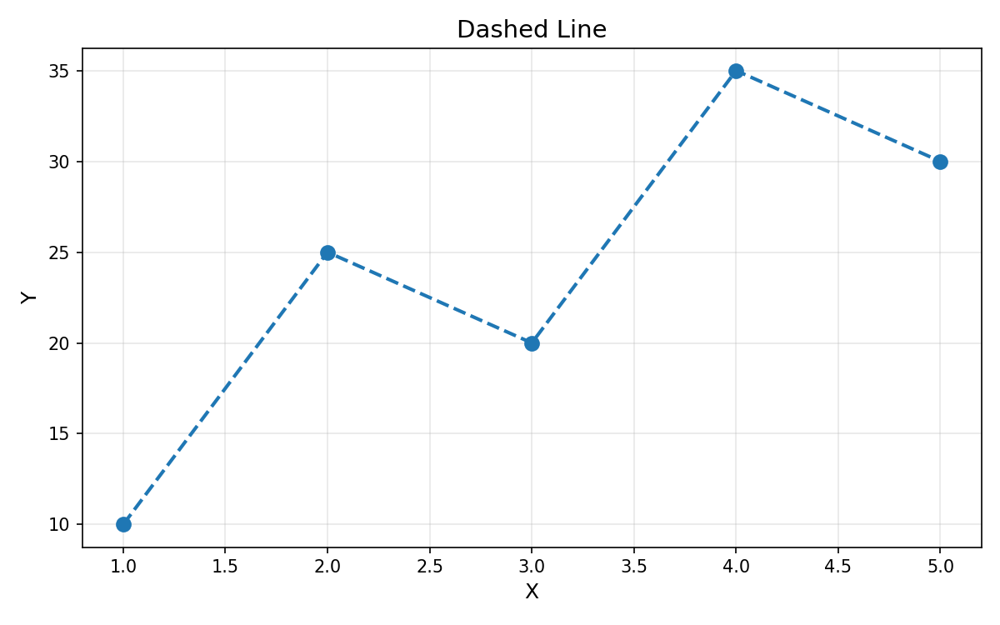
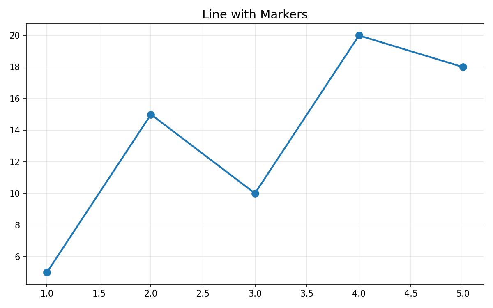

# Section2: 折れ線グラフと散布図 - 演習問題

## 📝 基本演習

---

### 演習1: 線のスタイルを変える

以下のコードを修正して、**破線（dashed）** のグラフを描いてください。

```python
import matplotlib.pyplot as plt

x = [1, 2, 3, 4, 5]
y = [10, 25, 20, 35, 30]

# ここを修正：破線にする
plt.plot(x, y)

plt.title("Dashed Line")
plt.xlabel("X")
plt.ylabel("Y")
plt.show()
```

**期待する出力:**



<details>
<summary>解答例を見る</summary>

```python
import matplotlib.pyplot as plt

x = [1, 2, 3, 4, 5]
y = [10, 25, 20, 35, 30]

# 破線にする
plt.plot(x, y, linestyle='--')

# または短縮形
# plt.plot(x, y, '--')

plt.title("Dashed Line")
plt.xlabel("X")
plt.ylabel("Y")
plt.show()
```

**解説:**
- `linestyle='--'` で破線を指定
- 短縮形として `plt.plot(x, y, '--')` も可能

</details>

---

### 演習2: マーカーを追加する

以下のコードを修正して、**丸いマーカー（○）** を追加してください。

```python
import matplotlib.pyplot as plt

x = [1, 2, 3, 4, 5]
y = [5, 15, 10, 20, 18]

# ここを修正：丸いマーカーを追加
plt.plot(x, y)

plt.title("Line with Markers")
plt.show()
```

**期待する出力:**



<details>
<summary>解答例を見る</summary>

```python
import matplotlib.pyplot as plt

x = [1, 2, 3, 4, 5]
y = [5, 15, 10, 20, 18]

# 丸いマーカーを追加
plt.plot(x, y, marker='o')

# マーカーのサイズも指定できる
# plt.plot(x, y, marker='o', markersize=8)

plt.title("Line with Markers")
plt.show()
```

**解説:**
- `marker='o'` で丸いマーカーを追加
- `markersize=8` でサイズも調整可能

</details>

---

### 演習3: 線の色を変える

以下のコードを修正して、**赤い線** で描画してください。

```python
import matplotlib.pyplot as plt

x = [1, 2, 3, 4, 5]
y = [10, 30, 20, 40, 35]

# ここを修正：赤い線にする
plt.plot(x, y)

plt.title("Red Line")
plt.show()
```

<details>
<summary>解答例を見る</summary>

```python
import matplotlib.pyplot as plt

x = [1, 2, 3, 4, 5]
y = [10, 30, 20, 40, 35]

# 赤い線にする
plt.plot(x, y, color='red')

# または短縮形
# plt.plot(x, y, 'r-')

# 16進数でも指定可能
# plt.plot(x, y, color='#FF0000')

plt.title("Red Line")
plt.show()
```

**解説:**
- `color='red'` で色を指定
- 短縮形 `'r-'` は「赤・実線」
- 16進数 `'#FF0000'` も使用可能

</details>

---

### 演習4: フォーマット文字列を使う

以下の条件を満たすグラフを **フォーマット文字列** で描いてください。

**条件:**
- 色: 緑
- マーカー: 三角（△）
- 線のスタイル: 点線

```python
import matplotlib.pyplot as plt

x = [1, 2, 3, 4, 5]
y = [8, 16, 12, 20, 18]

# フォーマット文字列で「緑・三角・点線」を指定
# ここにコードを書く

plt.title("Green Triangle Dotted")
plt.show()
```

<details>
<summary>解答例を見る</summary>

```python
import matplotlib.pyplot as plt

x = [1, 2, 3, 4, 5]
y = [8, 16, 12, 20, 18]

# フォーマット文字列で「緑・三角・点線」を指定
plt.plot(x, y, 'g^:')  # g=緑, ^=三角, :=点線

plt.title("Green Triangle Dotted")
plt.show()
```

**解説:**
- `'g^:'` は「緑（g）・三角（^）・点線（:）」
- フォーマット文字列は `色 + マーカー + 線種` の順

</details>

---

### 演習5: 基本の散布図

以下のデータで散布図を描いてください。

```python
import matplotlib.pyplot as plt

# 勉強時間と試験スコア
study_hours = [1, 2, 3, 4, 5, 6, 7, 8]
test_score = [40, 50, 55, 60, 70, 75, 85, 90]

# 散布図を描く
# ここにコードを書く

plt.title("Study Hours vs Test Score")
plt.xlabel("Study Hours")
plt.ylabel("Test Score")
plt.show()
```

**期待する出力:**


<details>
<summary>解答例を見る</summary>

```python
import matplotlib.pyplot as plt

# 勉強時間と試験スコア
study_hours = [1, 2, 3, 4, 5, 6, 7, 8]
test_score = [40, 50, 55, 60, 70, 75, 85, 90]

# 散布図を描く
plt.scatter(study_hours, test_score)

plt.title("Study Hours vs Test Score")
plt.xlabel("Study Hours")
plt.ylabel("Test Score")
plt.show()
```

**解説:**
- `plt.scatter(x, y)` で散布図を作成
- 時系列でなく、2変数の関係を見るときに使う

</details>

---

### 演習6: 散布図のカスタマイズ

演習5の散布図を以下のようにカスタマイズしてください。

**条件:**
- マーカーサイズ: 100
- 色: 青
- 透明度: 0.6
- 縁の色: 黒

```python
import matplotlib.pyplot as plt

study_hours = [1, 2, 3, 4, 5, 6, 7, 8]
test_score = [40, 50, 55, 60, 70, 75, 85, 90]

# カスタマイズした散布図を描く
# ここにコードを書く

plt.title("Study Hours vs Test Score")
plt.xlabel("Study Hours")
plt.ylabel("Test Score")
plt.grid(True, alpha=0.3)
plt.show()
```

<details>
<summary>解答例を見る</summary>

```python
import matplotlib.pyplot as plt

study_hours = [1, 2, 3, 4, 5, 6, 7, 8]
test_score = [40, 50, 55, 60, 70, 75, 85, 90]

# カスタマイズした散布図を描く
plt.scatter(study_hours, test_score,
            s=100,            # サイズ
            c='blue',         # 色
            alpha=0.6,        # 透明度
            edgecolor='black') # 縁の色

plt.title("Study Hours vs Test Score")
plt.xlabel("Study Hours")
plt.ylabel("Test Score")
plt.grid(True, alpha=0.3)
plt.show()
```

**解説:**
- `s=100`: マーカーのサイズ
- `c='blue'`: マーカーの色
- `alpha=0.6`: 透明度（0で透明、1で不透明）
- `edgecolor='black'`: 縁の色

</details>

---

### 演習7: 複数の線を区別する

以下の2つのデータを **視覚的に区別しやすく** 描いてください。

```python
import matplotlib.pyplot as plt

months = ["Jan", "Feb", "Mar", "Apr", "May"]
tokyo_temp = [6, 7, 11, 16, 20]      # 東京の気温
osaka_temp = [7, 8, 12, 17, 21]      # 大阪の気温

# 2つの線を区別して描く
# ここにコードを書く

plt.title("Temperature Comparison")
plt.xlabel("Month")
plt.ylabel("Temperature (°C)")
plt.legend()
plt.show()
```

<details>
<summary>解答例を見る</summary>

```python
import matplotlib.pyplot as plt

months = ["Jan", "Feb", "Mar", "Apr", "May"]
tokyo_temp = [6, 7, 11, 16, 20]      # 東京の気温
osaka_temp = [7, 8, 12, 17, 21]      # 大阪の気温

# 色・マーカー・線種で区別
plt.plot(months, tokyo_temp, 'ro-', label='Tokyo', linewidth=2, markersize=8)
plt.plot(months, osaka_temp, 'bs--', label='Osaka', linewidth=2, markersize=8)

plt.title("Temperature Comparison")
plt.xlabel("Month")
plt.ylabel("Temperature (°C)")
plt.legend()
plt.grid(True, alpha=0.3)
plt.show()
```

**解説:**
- `'ro-'`: 赤・丸・実線
- `'bs--'`: 青・四角・破線
- `label=` で凡例用の名前を設定
- `plt.legend()` で凡例を表示

</details>

---

### 演習8: データに応じたサイズ変更

以下のデータで、**売上に応じてマーカーのサイズを変える** 散布図を描いてください。

```python
import matplotlib.pyplot as plt

# 広告費と来店数、売上
ad_cost = [10, 20, 30, 40, 50]
visitors = [100, 180, 250, 320, 400]
sales = [50, 90, 130, 180, 220]  # サイズに使う

# マーカーサイズを売上に応じて変える
# ここにコードを書く

plt.title("Ad Cost vs Visitors (Size = Sales)")
plt.xlabel("Ad Cost")
plt.ylabel("Visitors")
plt.show()
```

**ヒント:** `s=` パラメータにリストを渡すと、各点のサイズを変えられます。

<details>
<summary>解答例を見る</summary>

```python
import matplotlib.pyplot as plt

# 広告費と来店数、売上
ad_cost = [10, 20, 30, 40, 50]
visitors = [100, 180, 250, 320, 400]
sales = [50, 90, 130, 180, 220]  # サイズに使う

# 売上をサイズに変換（見やすくするために拡大）
sizes = [s * 2 for s in sales]

# マーカーサイズを売上に応じて変える
plt.scatter(ad_cost, visitors, s=sizes, alpha=0.6, edgecolor='black')

plt.title("Ad Cost vs Visitors (Size = Sales)")
plt.xlabel("Ad Cost")
plt.ylabel("Visitors")
plt.show()
```

**解説:**
- `s=` にリストを渡すと各点のサイズが変わる
- 値をそのまま使うと小さすぎることがあるので調整

</details>

---

## ✅ 演習のまとめ

| 演習 | 学んだこと |
|------|------------|
| 1 | 線のスタイル（linestyle） |
| 2 | マーカーの追加（marker） |
| 3 | 線の色（color） |
| 4 | フォーマット文字列 |
| 5 | 基本の散布図（scatter） |
| 6 | 散布図のカスタマイズ |
| 7 | 複数線の区別 |
| 8 | サイズの変更 |

---

## 🔗 次のステップ

これらの基本を理解したら、「応用問題」で実践的な課題に挑戦しましょう！
