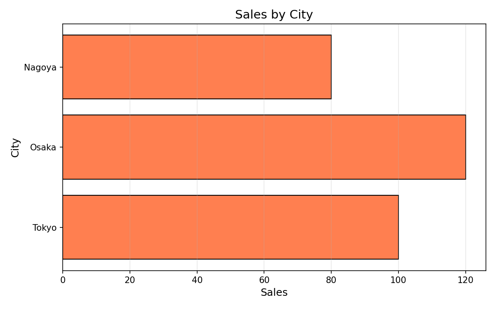
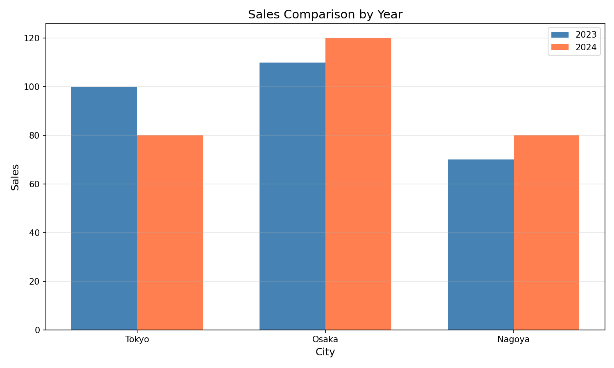
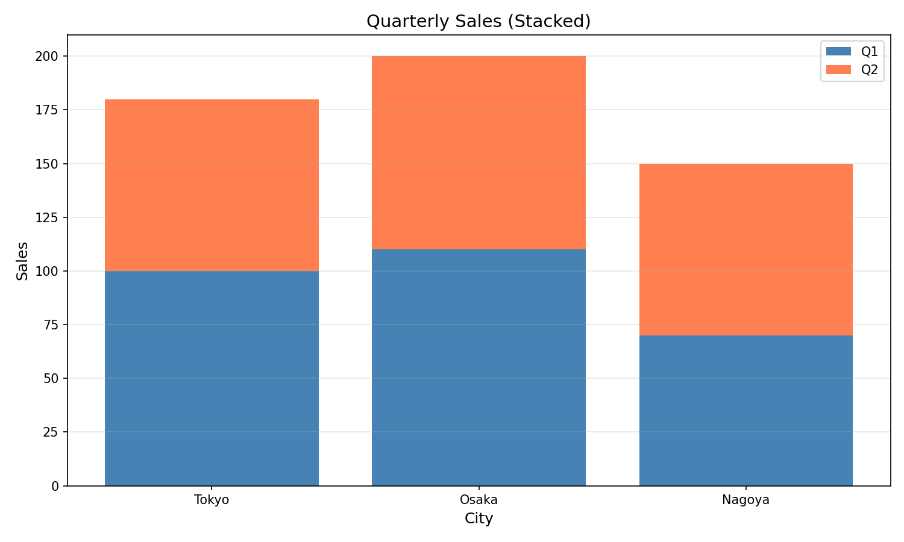
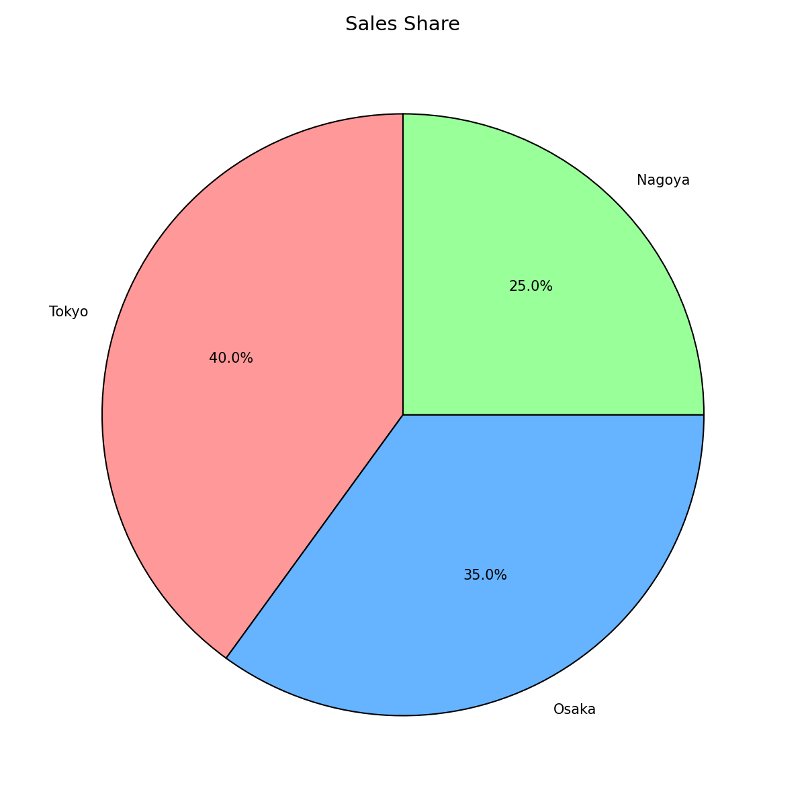

# Section3: 棒グラフとヒストグラム - 技術説明

## 🎯 このセクションで学ぶこと

棒グラフ、ヒストグラム、円グラフを使ったデータの可視化を学びます。
カテゴリ比較、分布の確認、割合の表現など、用途に応じた使い分けを習得します。

---

## 1. 棒グラフ（Bar Chart）

### 縦棒グラフ

縦棒グラフは、カテゴリごとの値を縦の棒で表現します。
棒の高さで値の大小を直感的に比較できます。


```python
import matplotlib.pyplot as plt

categories = ["Tokyo", "Osaka", "Nagoya"]
values = [100, 120, 80]

plt.bar(categories, values)
plt.title("Sales by City")
plt.xlabel("City")
plt.ylabel("Sales")
plt.show()
```

### 棒グラフのカスタマイズ

```
【棒グラフのオプション】

┌───────────┬───────────────────────────────────┐
│ パラメータ│ 説明                              │
├───────────┼───────────────────────────────────┤
│ color     │ 棒の色                            │
│ edgecolor │ 棒の縁の色                        │
│ width     │ 棒の幅（0〜1、デフォルト0.8）     │
│ alpha     │ 透明度（0〜1）                    │
│ linewidth │ 縁の太さ                          │
└───────────┴───────────────────────────────────┘
```

```python
import matplotlib.pyplot as plt

categories = ["Tokyo", "Osaka", "Nagoya"]
values = [100, 120, 80]

plt.figure(figsize=(10, 6))

plt.bar(categories, values,
        color='steelblue',    # 棒の色
        edgecolor='black',    # 縁の色
        width=0.6,            # 棒の幅
        alpha=0.8)            # 透明度

plt.title("Sales by City", fontsize=14)
plt.xlabel("City", fontsize=12)
plt.ylabel("Sales (万円)", fontsize=12)
plt.grid(axis='y', alpha=0.3)

plt.show()
```

### 横棒グラフ

横棒グラフは、カテゴリ名が長い場合や、ランキング表示に適しています。
`plt.barh()` を使って描画します。



```python
import matplotlib.pyplot as plt

categories = ["Tokyo", "Osaka", "Nagoya"]
values = [100, 120, 80]

# 横棒グラフは barh()
plt.barh(categories, values, color='coral')

plt.title("Sales by City")
plt.xlabel("Sales")
plt.ylabel("City")
plt.show()
```

---

## 2. 複数系列の棒グラフ

### グループ化棒グラフ

複数の系列を並べて比較するグラフです。
年度別やカテゴリ別の比較に便利です。



```python
import matplotlib.pyplot as plt
import numpy as np

categories = ["Tokyo", "Osaka", "Nagoya"]
values_2023 = [100, 110, 70]
values_2024 = [80, 120, 80]

# 棒の位置を計算
x = np.arange(len(categories))  # [0, 1, 2]
width = 0.35  # 棒の幅

plt.figure(figsize=(10, 6))

# 2つの系列を並べる
plt.bar(x - width/2, values_2023, width, label='2023', color='steelblue')
plt.bar(x + width/2, values_2024, width, label='2024', color='coral')

plt.xlabel("City")
plt.ylabel("Sales")
plt.title("Sales Comparison by Year")
plt.xticks(x, categories)  # x軸のラベルを設定
plt.legend()
plt.grid(axis='y', alpha=0.3)

plt.show()
```

### 積み上げ棒グラフ

各カテゴリの合計と内訳を同時に表現できます。
`bottom=` パラメータで下の棒を指定して積み上げます。



```python
import matplotlib.pyplot as plt

categories = ["Tokyo", "Osaka", "Nagoya"]
q1_sales = [100, 110, 70]
q2_sales = [80, 90, 80]

plt.figure(figsize=(10, 6))

# 積み上げ棒グラフ
plt.bar(categories, q1_sales, label='Q1', color='steelblue')
plt.bar(categories, q2_sales, bottom=q1_sales, label='Q2', color='coral')
# bottom= で下に置く棒を指定

plt.xlabel("City")
plt.ylabel("Sales")
plt.title("Quarterly Sales (Stacked)")
plt.legend()
plt.grid(axis='y', alpha=0.3)

plt.show()
```

---

## 3. ヒストグラム（Histogram）

### ヒストグラムとは

棒グラフはカテゴリごとの値を比較しますが、
ヒストグラムはデータの「分布」を表示します。
値の範囲を区間（ビン）に分け、各区間のデータ数を棒の高さで表します。


```python
import matplotlib.pyplot as plt

# テストの点数データ
scores = [65, 70, 72, 75, 78, 80, 82, 85, 88, 90, 92, 95,
          68, 73, 77, 81, 84, 87, 91, 93, 76, 79, 83, 86]

# ヒストグラム
plt.hist(scores)
plt.title("Score Distribution")
plt.xlabel("Score")
plt.ylabel("Frequency")
plt.show()
```

### ヒストグラムのオプション

```
【ヒストグラムのオプション】

┌───────────┬───────────────────────────────────┐
│ パラメータ│ 説明                              │
├───────────┼───────────────────────────────────┤
│ bins      │ ビンの数（区間の数）              │
│ range     │ 範囲 (min, max)                   │
│ color     │ 棒の色                            │
│ edgecolor │ 棒の縁の色                        │
│ alpha     │ 透明度                            │
│ density   │ True で正規化（合計=1）           │
└───────────┴───────────────────────────────────┘
```

```python
import matplotlib.pyplot as plt

scores = [65, 70, 72, 75, 78, 80, 82, 85, 88, 90, 92, 95,
          68, 73, 77, 81, 84, 87, 91, 93, 76, 79, 83, 86]

plt.figure(figsize=(10, 6))

plt.hist(scores,
         bins=10,            # 10個の区間に分ける
         range=(60, 100),    # 60〜100の範囲
         color='skyblue',    # 棒の色
         edgecolor='black',  # 縁の色
         alpha=0.7)          # 透明度

plt.title("Score Distribution", fontsize=14)
plt.xlabel("Score", fontsize=12)
plt.ylabel("Frequency", fontsize=12)
plt.grid(axis='y', alpha=0.3)

plt.show()
```

### 複数ヒストグラムの重ね合わせ

```python
import matplotlib.pyplot as plt
import random

random.seed(42)

# 2クラスの点数データ
class_a = [random.gauss(75, 10) for _ in range(30)]
class_b = [random.gauss(80, 8) for _ in range(30)]

plt.figure(figsize=(10, 6))

# 2つのヒストグラムを重ねる
plt.hist(class_a, bins=10, alpha=0.5, label='Class A', color='blue')
plt.hist(class_b, bins=10, alpha=0.5, label='Class B', color='red')

plt.title("Score Distribution by Class")
plt.xlabel("Score")
plt.ylabel("Frequency")
plt.legend()
plt.grid(axis='y', alpha=0.3)

plt.show()
```

---

## 4. 円グラフ（Pie Chart）

### 円グラフの基本

円グラフは全体に対する各カテゴリの「割合」を表現するのに適しています。
各セクションの面積が値の割合を示します。



```python
import matplotlib.pyplot as plt

labels = ["Tokyo", "Osaka", "Nagoya"]
values = [40, 35, 25]  # パーセント

plt.pie(values, labels=labels)
plt.title("Sales Share")
plt.show()
```

### 円グラフのカスタマイズ

```
【円グラフのオプション】

┌─────────────┬─────────────────────────────────────┐
│ パラメータ  │ 説明                                │
├─────────────┼─────────────────────────────────────┤
│ labels      │ 各セクションのラベル                │
│ autopct     │ パーセンテージの表示形式            │
│ startangle  │ 開始角度（0=3時の方向）             │
│ explode     │ 切り離す距離                        │
│ colors      │ 各セクションの色                    │
│ shadow      │ 影をつける（True/False）            │
│ wedgeprops  │ 扇形のプロパティ                    │
└─────────────┴─────────────────────────────────────┘
```

```python
import matplotlib.pyplot as plt

labels = ["Tokyo", "Osaka", "Nagoya", "Fukuoka"]
values = [35, 30, 20, 15]
colors = ['#ff9999', '#66b3ff', '#99ff99', '#ffcc99']
explode = [0.05, 0, 0, 0]  # Tokyoを少し切り離す

plt.figure(figsize=(10, 8))

plt.pie(values, 
        labels=labels,
        autopct='%1.1f%%',    # パーセント表示
        startangle=90,        # 12時の方向から開始
        explode=explode,      # 切り離す
        colors=colors,        # 色
        shadow=True,          # 影
        wedgeprops={'edgecolor': 'black', 'linewidth': 1})

plt.title("Sales Share by City", fontsize=14)
plt.axis('equal')  # 正円にする

plt.show()
```

### 円グラフのイメージ

パーセント表示、影、切り離しなどのオプションを使って、
より見やすくカスタマイズした円グラフの例です。


---

## 5. 箱ひげ図（Box Plot）

### 箱ひげ図とは

```
【箱ひげ図の構造】

                   最大値
                     │
       上ひげ  ──────┴──────
                     
                ┌─────────┐
                │         │
       Q3 ──────┤         │
                │   箱    │
       中央値 ──┼─────────┤
                │         │
       Q1 ──────┤         │
                └─────────┘
                     
       下ひげ  ──────┬──────
                     │
                   最小値

  ○ 外れ値（ひげの範囲外の点）
```

```python
import matplotlib.pyplot as plt
import random

random.seed(42)

# 3クラスのテスト点数データ
class_a = [random.gauss(75, 10) for _ in range(30)]
class_b = [random.gauss(80, 8) for _ in range(30)]
class_c = [random.gauss(70, 15) for _ in range(30)]

data = [class_a, class_b, class_c]

plt.figure(figsize=(10, 6))

plt.boxplot(data, labels=['Class A', 'Class B', 'Class C'])

plt.title("Score Distribution by Class", fontsize=14)
plt.xlabel("Class", fontsize=12)
plt.ylabel("Score", fontsize=12)
plt.grid(axis='y', alpha=0.3)

plt.show()
```

---

## 6. 実践：売上分析ダッシュボード

```python
import matplotlib.pyplot as plt
import numpy as np
import random

random.seed(42)

# データ準備
cities = ["Tokyo", "Osaka", "Nagoya", "Fukuoka"]
sales_2023 = [100, 90, 70, 60]
sales_2024 = [120, 95, 80, 75]

# 売上の分布データ（各都市の月別売上）
tokyo_monthly = [random.gauss(100, 15) for _ in range(12)]
osaka_monthly = [random.gauss(90, 12) for _ in range(12)]

# 売上構成比
categories = ["Product A", "Product B", "Product C", "Other"]
shares = [45, 25, 20, 10]

# 図を2x2で配置
fig, axes = plt.subplots(2, 2, figsize=(14, 10))

# === 1. グループ化棒グラフ ===
ax1 = axes[0, 0]
x = np.arange(len(cities))
width = 0.35
ax1.bar(x - width/2, sales_2023, width, label='2023', color='steelblue')
ax1.bar(x + width/2, sales_2024, width, label='2024', color='coral')
ax1.set_xlabel("City")
ax1.set_ylabel("Sales")
ax1.set_title("Sales by City (Year Comparison)")
ax1.set_xticks(x)
ax1.set_xticklabels(cities)
ax1.legend()
ax1.grid(axis='y', alpha=0.3)

# === 2. ヒストグラム ===
ax2 = axes[0, 1]
ax2.hist(tokyo_monthly, bins=8, alpha=0.7, label='Tokyo', color='blue')
ax2.hist(osaka_monthly, bins=8, alpha=0.7, label='Osaka', color='red')
ax2.set_xlabel("Monthly Sales")
ax2.set_ylabel("Frequency")
ax2.set_title("Sales Distribution")
ax2.legend()
ax2.grid(axis='y', alpha=0.3)

# === 3. 円グラフ ===
ax3 = axes[1, 0]
ax3.pie(shares, labels=categories, autopct='%1.1f%%',
        startangle=90, colors=['#ff9999', '#66b3ff', '#99ff99', '#ffcc99'],
        wedgeprops={'edgecolor': 'black', 'linewidth': 1})
ax3.set_title("Sales by Product Category")

# === 4. 箱ひげ図 ===
ax4 = axes[1, 1]
all_monthly = [tokyo_monthly, osaka_monthly]
ax4.boxplot(all_monthly, labels=['Tokyo', 'Osaka'])
ax4.set_xlabel("City")
ax4.set_ylabel("Monthly Sales")
ax4.set_title("Sales Variation by City")
ax4.grid(axis='y', alpha=0.3)

plt.tight_layout()
plt.savefig("dashboard.png", dpi=150)
plt.show()
```

**出力イメージ:**

上記のコードで生成されるダッシュボードです。4種類のグラフを
2x2のグリッドに配置し、売上データを多角的に分析できます。


---

## ✅ このセクションで学んだこと

1. **棒グラフ**: `plt.bar()` でカテゴリ比較
2. **横棒グラフ**: `plt.barh()` で横向き表示
3. **グループ化棒グラフ**: 複数系列を並べて比較
4. **積み上げ棒グラフ**: `bottom=` で積み上げ
5. **ヒストグラム**: `plt.hist()` で分布を表示
6. **円グラフ**: `plt.pie()` で割合を表示
7. **箱ひげ図**: `plt.boxplot()` で分布の比較

---

## 🔗 次のセクション

次は「Section4: グラフの装飾」で、
グラフをより見やすく美しくする方法を学びます！
