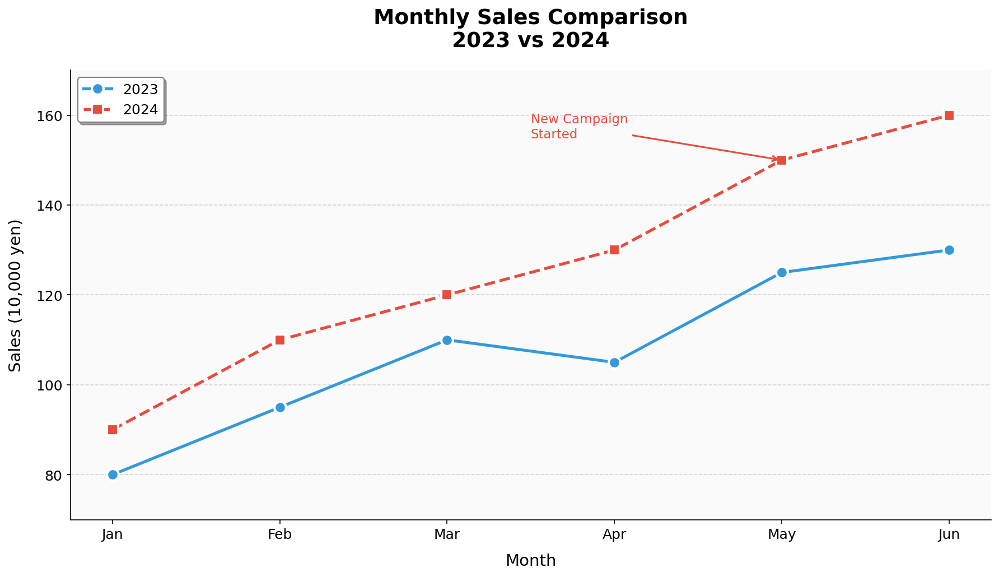

# Section4: グラフの装飾 - 技術説明

## 🎯 このセクションで学ぶこと

グラフをより見やすく、美しく仕上げるための装飾テクニックを学びます。
タイトル、軸ラベル、凡例、グリッド、注釈など、プレゼンテーション品質のグラフを作成します。

---

## 1. タイトルと軸ラベルの詳細設定

### フォントサイズと位置

```
【タイトル・ラベルの装飾】

         ← fontsize=16, fontweight='bold' →
     ┌─────────────────────────────────────────┐
     │         Monthly Sales Report            │ ← タイトル
     │                                         │
     │  S                                      │
     │  a      /\                              │
     │  l     /  \    ← グラフ本体             │
     │  e    /    \                            │
     │  s   /      \                           │
     │     ─────────────────                   │
     │         Month                           │ ← x軸ラベル
     │                                         │
     └─────────────────────────────────────────┘
           ↑
       y軸ラベル
```

```python
import matplotlib.pyplot as plt

x = [1, 2, 3, 4, 5]
y = [10, 25, 20, 35, 30]

plt.figure(figsize=(10, 6))
plt.plot(x, y, 'b-o', linewidth=2)

# タイトルの詳細設定
plt.title('Monthly Sales Report', 
          fontsize=16,          # フォントサイズ
          fontweight='bold',    # 太字
          color='darkblue',     # 色
          loc='center')         # 位置（left, center, right）

# 軸ラベルの詳細設定
plt.xlabel('Month', fontsize=12, color='gray')
plt.ylabel('Sales (万円)', fontsize=12, color='gray')

plt.show()
```

### 軸の目盛り設定

```
【目盛りのカスタマイズ】

     ^
 100 ├─ ← y軸目盛りの位置
  80 ├─
  60 ├─
  40 ├─
  20 ├─
     └──┬──┬──┬──┬──→
       Jan Feb Mar Apr May
            ↑
       x軸目盛りの回転
```

```python
import matplotlib.pyplot as plt

months = ['January', 'February', 'March', 'April', 'May']
values = [20, 40, 60, 80, 100]

plt.figure(figsize=(10, 6))
plt.bar(months, values)

# x軸の目盛りを回転
plt.xticks(rotation=45, ha='right')  # ha=horizontal alignment

# y軸の目盛り位置を指定
plt.yticks([0, 25, 50, 75, 100])

# 目盛りラベルのフォントサイズ
plt.tick_params(axis='both', labelsize=10)

plt.tight_layout()  # はみ出し防止
plt.show()
```

---

## 2. 凡例（Legend）の詳細設定

### 凡例の位置

```
【凡例の位置（loc パラメータ）】

  ┌─────────────────────────────────────────┐
  │ upper left   upper center  upper right  │
  │                                         │
  │ center left     center     center right │
  │                                         │
  │ lower left   lower center  lower right  │
  └─────────────────────────────────────────┘

  best : 自動で最適な位置を選択
```

```python
import matplotlib.pyplot as plt

x = [1, 2, 3, 4, 5]
y1 = [10, 20, 15, 25, 20]
y2 = [8, 18, 12, 22, 18]

plt.figure(figsize=(10, 6))
plt.plot(x, y1, 'r-o', label='Product A')
plt.plot(x, y2, 'b-s', label='Product B')

# 凡例の位置を指定
plt.legend(loc='upper left')

# または座標で指定（グラフ領域内の相対位置）
# plt.legend(loc=(0.7, 0.8))

plt.show()
```

### 凡例のカスタマイズ

```python
import matplotlib.pyplot as plt

x = [1, 2, 3, 4, 5]
y1 = [10, 20, 15, 25, 20]
y2 = [8, 18, 12, 22, 18]

plt.figure(figsize=(10, 6))
plt.plot(x, y1, 'r-o', label='Product A')
plt.plot(x, y2, 'b-s', label='Product B')

# 凡例の詳細設定
plt.legend(
    loc='upper left',       # 位置
    fontsize=12,            # フォントサイズ
    title='Products',       # タイトル
    title_fontsize=14,      # タイトルのフォントサイズ
    frameon=True,           # 枠の有無
    facecolor='white',      # 背景色
    edgecolor='gray',       # 枠の色
    shadow=True,            # 影
    ncol=2                  # 列数（横並び）
)

plt.show()
```

---

## 3. グリッド線の設定

### 基本のグリッド

```
【グリッドの種類】

  x軸のみ           y軸のみ           両方
     ^                 ^                 ^
     | | | | |         |────────         |─|─|─|─|
     | | | | |         |────────         |─|─|─|─|
     | | | | |         |────────         |─|─|─|─|
     └─┴─┴─┴─→         └───────→         └─┴─┴─┴─→
```

```python
import matplotlib.pyplot as plt

x = [1, 2, 3, 4, 5]
y = [10, 20, 15, 25, 20]

plt.figure(figsize=(10, 6))
plt.plot(x, y, 'b-o')

# 基本のグリッド
plt.grid(True)

# y軸のみのグリッド
# plt.grid(True, axis='y')

# x軸のみのグリッド
# plt.grid(True, axis='x')

plt.show()
```

### グリッドのカスタマイズ

```python
import matplotlib.pyplot as plt

x = [1, 2, 3, 4, 5]
y = [10, 20, 15, 25, 20]

plt.figure(figsize=(10, 6))
plt.plot(x, y, 'b-o')

# グリッドの詳細設定
plt.grid(
    True,
    axis='both',            # x, y, both
    linestyle='--',         # 線のスタイル
    linewidth=0.5,          # 線の太さ
    color='gray',           # 色
    alpha=0.7               # 透明度
)

plt.show()
```

### 主グリッドと副グリッド

```python
import matplotlib.pyplot as plt

x = [1, 2, 3, 4, 5]
y = [10, 20, 15, 25, 20]

plt.figure(figsize=(10, 6))
plt.plot(x, y, 'b-o')

# 副目盛りを有効化
plt.minorticks_on()

# 主グリッド（major）
plt.grid(True, which='major', linestyle='-', linewidth=0.8, alpha=0.7)

# 副グリッド（minor）
plt.grid(True, which='minor', linestyle=':', linewidth=0.5, alpha=0.5)

plt.show()
```

---

## 4. 軸の範囲と目盛り

### 軸の範囲設定

```python
import matplotlib.pyplot as plt

x = [1, 2, 3, 4, 5]
y = [10, 20, 15, 25, 20]

plt.figure(figsize=(10, 6))
plt.plot(x, y, 'b-o')

# 軸の範囲を設定
plt.xlim(0, 6)   # x軸の範囲
plt.ylim(0, 30)  # y軸の範囲

# または一度に設定
# plt.axis([0, 6, 0, 30])  # [xmin, xmax, ymin, ymax]

plt.show()
```

### カスタム目盛り

```python
import matplotlib.pyplot as plt

months = [1, 2, 3, 4, 5, 6]
sales = [100, 120, 110, 130, 140, 150]

plt.figure(figsize=(10, 6))
plt.plot(months, sales, 'b-o')

# x軸の目盛りをカスタマイズ
plt.xticks(
    [1, 2, 3, 4, 5, 6],                           # 位置
    ['Jan', 'Feb', 'Mar', 'Apr', 'May', 'Jun']    # ラベル
)

# y軸の目盛りをカスタマイズ
plt.yticks([100, 110, 120, 130, 140, 150])

plt.title("Monthly Sales")
plt.xlabel("Month")
plt.ylabel("Sales")
plt.show()
```

---

## 5. テキストと注釈

### テキストの追加

```
【テキストの配置】

     ^
     |        * ← ここに注釈
     |       /
     |      / "Peak in April"
     |     /
     +──────────────→
```

```python
import matplotlib.pyplot as plt

x = [1, 2, 3, 4, 5]
y = [10, 20, 15, 30, 25]

plt.figure(figsize=(10, 6))
plt.plot(x, y, 'b-o')

# テキストを追加
plt.text(4, 30, 'Peak!',           # (x, y, text)
         fontsize=12,
         color='red',
         ha='center',              # 水平位置揃え
         va='bottom')              # 垂直位置揃え

plt.title("Sales Trend")
plt.show()
```

### 矢印付き注釈

```python
import matplotlib.pyplot as plt

x = [1, 2, 3, 4, 5]
y = [10, 20, 15, 30, 25]

plt.figure(figsize=(10, 6))
plt.plot(x, y, 'b-o')

# 矢印付き注釈
plt.annotate('Maximum Value',      # テキスト
             xy=(4, 30),           # 矢印の先（注目点）
             xytext=(3, 35),       # テキストの位置
             fontsize=12,
             arrowprops=dict(
                 arrowstyle='->',   # 矢印のスタイル
                 color='red',
                 lw=2               # 線の太さ
             ))

plt.title("Sales Trend with Annotation")
plt.ylim(0, 40)
plt.show()
```

---

## 6. 図のサイズと解像度

### 図のサイズ設定

```python
import matplotlib.pyplot as plt

# 図のサイズを指定（インチ単位）
plt.figure(figsize=(12, 6))  # 幅12インチ、高さ6インチ

x = [1, 2, 3, 4, 5]
y = [10, 20, 15, 25, 20]

plt.plot(x, y, 'b-o')
plt.title("Custom Size Figure")
plt.show()
```

### 高解像度での保存

```python
import matplotlib.pyplot as plt

x = [1, 2, 3, 4, 5]
y = [10, 20, 15, 25, 20]

plt.figure(figsize=(10, 6))
plt.plot(x, y, 'b-o')
plt.title("High Resolution Figure")

# 高解像度で保存
plt.savefig('figure.png', 
            dpi=300,              # 解像度（印刷用は300以上）
            bbox_inches='tight',  # 余白を最小化
            facecolor='white',    # 背景色
            edgecolor='none')     # 縁の色

plt.show()
```

---

## 7. スタイルの適用

### 組み込みスタイル

```
【利用可能なスタイル例】

  'seaborn'       : モダンで見やすい
  'ggplot'        : R言語のggplot2風
  'fivethirtyeight': データジャーナリズム風
  'dark_background': 暗い背景
  'bmh'           : Bayesian Methods for Hackers風
  'grayscale'     : 白黒印刷向け
```

```python
import matplotlib.pyplot as plt

# 利用可能なスタイルを確認
print(plt.style.available)

# スタイルを適用
plt.style.use('seaborn-v0_8-whitegrid')
# または plt.style.use('ggplot')

x = [1, 2, 3, 4, 5]
y = [10, 20, 15, 25, 20]

plt.figure(figsize=(10, 6))
plt.plot(x, y, 'o-', linewidth=2, markersize=8)
plt.title("Styled Chart", fontsize=14)
plt.xlabel("X")
plt.ylabel("Y")
plt.show()

# デフォルトに戻す
plt.style.use('default')
```

### 一時的なスタイル適用

```python
import matplotlib.pyplot as plt

x = [1, 2, 3, 4, 5]
y = [10, 20, 15, 25, 20]

# with文で一時的にスタイルを適用
with plt.style.context('ggplot'):
    plt.figure(figsize=(10, 6))
    plt.plot(x, y, 'o-')
    plt.title("ggplot Style")
    plt.show()

# ここではデフォルトスタイルに戻っている
```

---

## 8. 実践：プレゼンテーション品質のグラフ

```python
import matplotlib.pyplot as plt

# データ
months = ['Jan', 'Feb', 'Mar', 'Apr', 'May', 'Jun']
sales_2023 = [80, 95, 110, 105, 125, 130]
sales_2024 = [90, 110, 120, 130, 150, 160]

# 図のサイズと解像度
fig, ax = plt.subplots(figsize=(12, 7))

# データをプロット
ax.plot(months, sales_2023, 'o-', 
        color='#3498db', linewidth=2.5, markersize=10, 
        label='2023', markeredgecolor='white', markeredgewidth=2)
ax.plot(months, sales_2024, 's--', 
        color='#e74c3c', linewidth=2.5, markersize=10, 
        label='2024', markeredgecolor='white', markeredgewidth=2)

# タイトルと軸ラベル
ax.set_title('Monthly Sales Comparison\n2023 vs 2024', 
             fontsize=18, fontweight='bold', pad=20)
ax.set_xlabel('Month', fontsize=14, labelpad=10)
ax.set_ylabel('Sales (万円)', fontsize=14, labelpad=10)

# 軸の範囲
ax.set_ylim(70, 170)

# グリッド
ax.grid(True, linestyle='--', alpha=0.5, axis='y')

# 凡例
ax.legend(loc='upper left', fontsize=12, frameon=True, 
          facecolor='white', edgecolor='gray', shadow=True)

# 目盛りのフォントサイズ
ax.tick_params(axis='both', labelsize=12)

# 注釈を追加
ax.annotate('New Campaign\nStarted', 
            xy=(4, 150), xytext=(2.5, 155),
            fontsize=11, color='#e74c3c',
            arrowprops=dict(arrowstyle='->', color='#e74c3c', lw=1.5))

# 背景色
ax.set_facecolor('#fafafa')

# 枠線
for spine in ['top', 'right']:
    ax.spines[spine].set_visible(False)

# 余白を調整
plt.tight_layout()

# 高解像度で保存
plt.savefig('presentation_chart.png', dpi=300, 
            bbox_inches='tight', facecolor='white')
plt.show()
```

**出力イメージ:**

上記のコードで生成されるプロフェッショナルなグラフの例です。
タイトル、軸ラベル、凡例、グリッド、注釈、背景色などが統一感のあるデザインで設定されています。



---

## ✅ このセクションで学んだこと

1. **タイトル・ラベル**: fontsize, fontweight, color
2. **目盛り**: xticks, yticks, rotation
3. **凡例**: loc, fontsize, title, ncol
4. **グリッド**: axis, linestyle, alpha
5. **軸の範囲**: xlim, ylim
6. **テキスト・注釈**: text, annotate
7. **サイズ・解像度**: figsize, dpi
8. **スタイル**: plt.style.use()

---

## 🔗 次のセクション

次は「Section5: 複数グラフとエクスポート」で、
複数のグラフを効率的に配置し、様々な形式で保存する方法を学びます！
