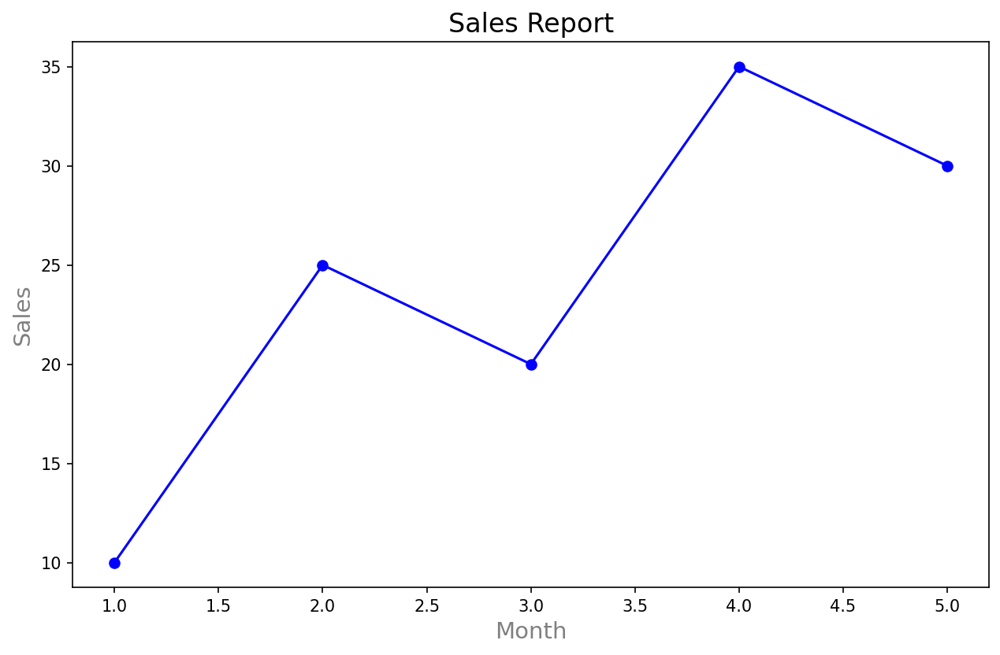
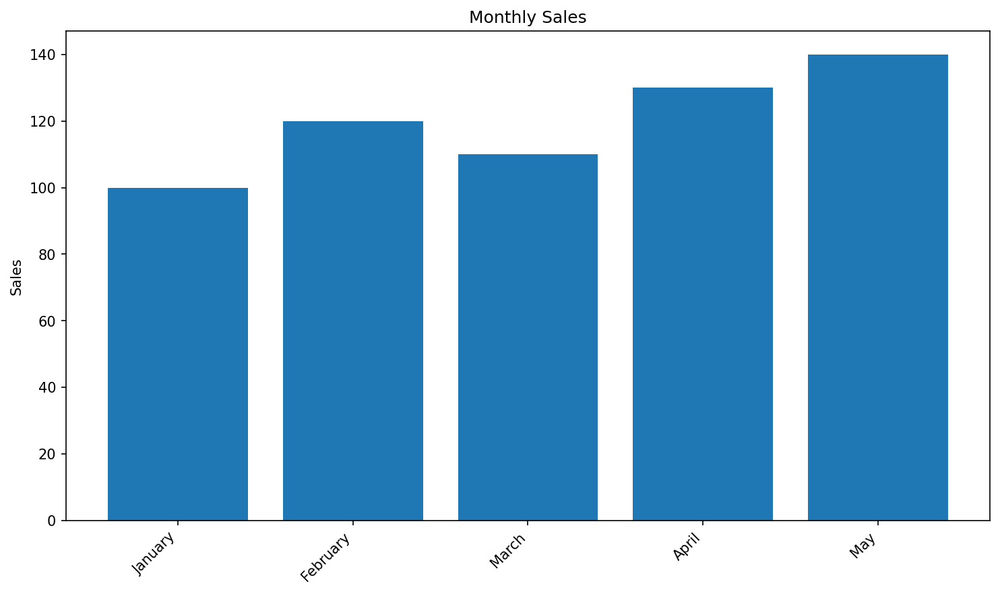
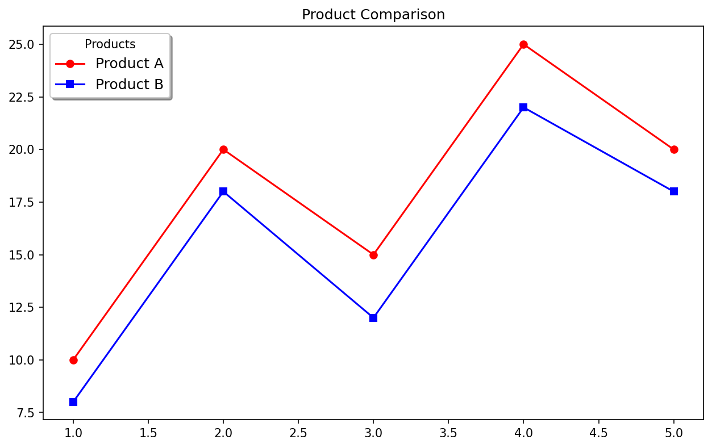
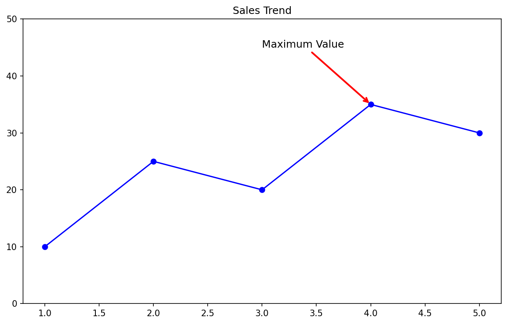

# Section4: グラフの装飾 - 演習問題

## 📝 基本演習

---

### 演習1: タイトルの装飾

以下のコードのタイトルを装飾してください。

**要件:**
- フォントサイズ: 16
- 太字
- 色: ダークブルー

```python
import matplotlib.pyplot as plt

x = [1, 2, 3, 4, 5]
y = [10, 25, 20, 35, 30]

plt.figure(figsize=(10, 6))
plt.plot(x, y, 'b-o')

# ここを修正：タイトルを装飾
plt.title('Sales Report')

plt.xlabel('Month')
plt.ylabel('Sales')
plt.show()
```

**期待する出力:**


<details>
<summary>解答例を見る</summary>

```python
import matplotlib.pyplot as plt

x = [1, 2, 3, 4, 5]
y = [10, 25, 20, 35, 30]

plt.figure(figsize=(10, 6))
plt.plot(x, y, 'b-o')

# タイトルを装飾
plt.title('Sales Report', 
          fontsize=16, 
          fontweight='bold', 
          color='darkblue')

plt.xlabel('Month')
plt.ylabel('Sales')
plt.show()
```

**解説:**
- `fontsize=16`: フォントサイズ
- `fontweight='bold'`: 太字
- `color='darkblue'`: 色

</details>

---

### 演習2: 軸ラベルの装飾

軸ラベルを以下のように装飾してください。

**要件:**
- x軸ラベル: フォントサイズ14、グレー
- y軸ラベル: フォントサイズ14、グレー

```python
import matplotlib.pyplot as plt

x = [1, 2, 3, 4, 5]
y = [10, 25, 20, 35, 30]

plt.figure(figsize=(10, 6))
plt.plot(x, y, 'b-o')
plt.title('Sales Report', fontsize=16)

# ここを修正：軸ラベルを装飾
plt.xlabel('Month')
plt.ylabel('Sales')

plt.show()
```

**期待する出力:**



<details>
<summary>解答例を見る</summary>

```python
import matplotlib.pyplot as plt

x = [1, 2, 3, 4, 5]
y = [10, 25, 20, 35, 30]

plt.figure(figsize=(10, 6))
plt.plot(x, y, 'b-o')
plt.title('Sales Report', fontsize=16)

# 軸ラベルを装飾
plt.xlabel('Month', fontsize=14, color='gray')
plt.ylabel('Sales', fontsize=14, color='gray')

plt.show()
```

**解説:**
- `fontsize=14`: フォントサイズ
- `color='gray'`: 色

</details>

---

### 演習3: x軸の目盛りを回転

長いカテゴリ名が重ならないように、x軸の目盛りを **45度回転** させてください。

```python
import matplotlib.pyplot as plt

categories = ['January', 'February', 'March', 'April', 'May']
values = [100, 120, 110, 130, 140]

plt.figure(figsize=(10, 6))
plt.bar(categories, values)

# ここにコードを追加：x軸を45度回転

plt.title('Monthly Sales')
plt.ylabel('Sales')
plt.tight_layout()
plt.show()
```

**期待する出力:**



<details>
<summary>解答例を見る</summary>

```python
import matplotlib.pyplot as plt

categories = ['January', 'February', 'March', 'April', 'May']
values = [100, 120, 110, 130, 140]

plt.figure(figsize=(10, 6))
plt.bar(categories, values)

# x軸を45度回転
plt.xticks(rotation=45, ha='right')  # ha = horizontal alignment

plt.title('Monthly Sales')
plt.ylabel('Sales')
plt.tight_layout()
plt.show()
```

**解説:**
- `rotation=45`: 45度回転
- `ha='right'`: ラベルを右揃えにして見やすく
- `plt.tight_layout()`: はみ出しを防止

</details>

---

### 演習4: 凡例の位置を変える

凡例を **右下** に配置してください。

```python
import matplotlib.pyplot as plt

x = [1, 2, 3, 4, 5]
y1 = [10, 20, 15, 25, 20]
y2 = [8, 18, 12, 22, 18]

plt.figure(figsize=(10, 6))
plt.plot(x, y1, 'r-o', label='Product A')
plt.plot(x, y2, 'b-s', label='Product B')

# ここを修正：凡例を右下に
plt.legend()

plt.title('Product Comparison')
plt.show()
```

**期待する出力:**


<details>
<summary>解答例を見る</summary>

```python
import matplotlib.pyplot as plt

x = [1, 2, 3, 4, 5]
y1 = [10, 20, 15, 25, 20]
y2 = [8, 18, 12, 22, 18]

plt.figure(figsize=(10, 6))
plt.plot(x, y1, 'r-o', label='Product A')
plt.plot(x, y2, 'b-s', label='Product B')

# 凡例を右下に
plt.legend(loc='lower right')

plt.title('Product Comparison')
plt.show()
```

**解説:**
- `loc='lower right'` で右下に配置
- 他の選択肢: 'upper left', 'center', 'best' など

</details>

---

### 演習5: 凡例の詳細設定

凡例を以下のように装飾してください。

**要件:**
- タイトル: "Products"
- フォントサイズ: 12
- 枠あり、影あり
- 背景色: 白

```python
import matplotlib.pyplot as plt

x = [1, 2, 3, 4, 5]
y1 = [10, 20, 15, 25, 20]
y2 = [8, 18, 12, 22, 18]

plt.figure(figsize=(10, 6))
plt.plot(x, y1, 'r-o', label='Product A')
plt.plot(x, y2, 'b-s', label='Product B')

# ここを修正：凡例を装飾
plt.legend()

plt.title('Product Comparison')
plt.show()
```

**期待する出力:**



<details>
<summary>解答例を見る</summary>

```python
import matplotlib.pyplot as plt

x = [1, 2, 3, 4, 5]
y1 = [10, 20, 15, 25, 20]
y2 = [8, 18, 12, 22, 18]

plt.figure(figsize=(10, 6))
plt.plot(x, y1, 'r-o', label='Product A')
plt.plot(x, y2, 'b-s', label='Product B')

# 凡例を装飾
plt.legend(
    title='Products',        # タイトル
    fontsize=12,             # フォントサイズ
    frameon=True,            # 枠あり
    shadow=True,             # 影あり
    facecolor='white'        # 背景色
)

plt.title('Product Comparison')
plt.show()
```

**解説:**
- `title='Products'`: 凡例のタイトル
- `frameon=True`: 枠を表示
- `shadow=True`: 影を追加

</details>

---

### 演習6: グリッドの追加

y軸方向のみにグリッドを追加してください。
また、グリッドを破線にして透明度を0.5にしてください。

```python
import matplotlib.pyplot as plt

x = [1, 2, 3, 4, 5]
y = [10, 25, 20, 35, 30]

plt.figure(figsize=(10, 6))
plt.bar(x, y)

# ここにコードを追加：y軸グリッドを追加

plt.title('Sales')
plt.show()
```

**期待する出力:**


<details>
<summary>解答例を見る</summary>

```python
import matplotlib.pyplot as plt

x = [1, 2, 3, 4, 5]
y = [10, 25, 20, 35, 30]

plt.figure(figsize=(10, 6))
plt.bar(x, y)

# y軸グリッドを追加
plt.grid(True, axis='y', linestyle='--', alpha=0.5)

plt.title('Sales')
plt.show()
```

**解説:**
- `axis='y'`: y軸方向のみ
- `linestyle='--'`: 破線
- `alpha=0.5`: 透明度

</details>

---

### 演習7: 軸の範囲を設定

y軸の範囲を **0〜50** に設定してください。

```python
import matplotlib.pyplot as plt

x = [1, 2, 3, 4, 5]
y = [10, 25, 20, 35, 30]

plt.figure(figsize=(10, 6))
plt.plot(x, y, 'b-o')

# ここにコードを追加：y軸の範囲を0〜50に

plt.title('Sales Trend')
plt.show()
```

**期待する出力:**


<details>
<summary>解答例を見る</summary>

```python
import matplotlib.pyplot as plt

x = [1, 2, 3, 4, 5]
y = [10, 25, 20, 35, 30]

plt.figure(figsize=(10, 6))
plt.plot(x, y, 'b-o')

# y軸の範囲を0〜50に
plt.ylim(0, 50)

# x軸も設定する場合
# plt.xlim(0, 6)

plt.title('Sales Trend')
plt.show()
```

**解説:**
- `plt.ylim(ymin, ymax)` でy軸の範囲を設定
- `plt.xlim(xmin, xmax)` でx軸の範囲を設定

</details>

---

### 演習8: テキストを追加

グラフ上の最大値の点に "Peak" というテキストを追加してください。

```python
import matplotlib.pyplot as plt

x = [1, 2, 3, 4, 5]
y = [10, 25, 20, 35, 30]  # 最大値は x=4, y=35

plt.figure(figsize=(10, 6))
plt.plot(x, y, 'b-o')

# ここにコードを追加：x=4, y=35 の位置に "Peak" と表示

plt.title('Sales Trend')
plt.show()
```

**期待する出力:**


<details>
<summary>解答例を見る</summary>

```python
import matplotlib.pyplot as plt

x = [1, 2, 3, 4, 5]
y = [10, 25, 20, 35, 30]

plt.figure(figsize=(10, 6))
plt.plot(x, y, 'b-o')

# テキストを追加
plt.text(4, 35, 'Peak', 
         fontsize=12, 
         color='red',
         ha='center',    # 水平方向の位置揃え
         va='bottom')    # 垂直方向の位置揃え

plt.title('Sales Trend')
plt.ylim(0, 45)
plt.show()
```

**解説:**
- `plt.text(x, y, 'text')` でテキストを追加
- `ha='center'`: 水平方向中央揃え
- `va='bottom'`: 垂直方向下揃え（点の上に表示）

</details>

---

### 演習9: 矢印付き注釈

演習8のテキストを矢印付きの注釈に変更してください。

```python
import matplotlib.pyplot as plt

x = [1, 2, 3, 4, 5]
y = [10, 25, 20, 35, 30]

plt.figure(figsize=(10, 6))
plt.plot(x, y, 'b-o')

# ここにコードを追加：矢印付きで "Maximum Value" と注釈

plt.title('Sales Trend')
plt.ylim(0, 50)
plt.show()
```

**期待する出力:**



<details>
<summary>解答例を見る</summary>

```python
import matplotlib.pyplot as plt

x = [1, 2, 3, 4, 5]
y = [10, 25, 20, 35, 30]

plt.figure(figsize=(10, 6))
plt.plot(x, y, 'b-o')

# 矢印付き注釈
plt.annotate('Maximum Value',
             xy=(4, 35),           # 矢印の先
             xytext=(3, 45),       # テキストの位置
             fontsize=12,
             arrowprops=dict(
                 arrowstyle='->',
                 color='red',
                 lw=2
             ))

plt.title('Sales Trend')
plt.ylim(0, 50)
plt.show()
```

**解説:**
- `xy`: 矢印の先（注目点）
- `xytext`: テキストの位置
- `arrowprops`: 矢印のスタイル

</details>

---

### 演習10: 高解像度で保存

グラフを以下の条件で保存してください。

**要件:**
- ファイル名: "my_chart.png"
- 解像度: 300 dpi
- 余白を最小化
- 背景色: 白

```python
import matplotlib.pyplot as plt

x = [1, 2, 3, 4, 5]
y = [10, 25, 20, 35, 30]

plt.figure(figsize=(10, 6))
plt.plot(x, y, 'b-o')
plt.title('Sales Trend')
plt.xlabel('Month')
plt.ylabel('Sales')
plt.grid(True, alpha=0.3)

# ここにコードを追加：高解像度で保存

plt.show()
```

**期待する出力:**


<details>
<summary>解答例を見る</summary>

```python
import matplotlib.pyplot as plt

x = [1, 2, 3, 4, 5]
y = [10, 25, 20, 35, 30]

plt.figure(figsize=(10, 6))
plt.plot(x, y, 'b-o')
plt.title('Sales Trend')
plt.xlabel('Month')
plt.ylabel('Sales')
plt.grid(True, alpha=0.3)

# 高解像度で保存
plt.savefig('my_chart.png',
            dpi=300,              # 解像度
            bbox_inches='tight',  # 余白を最小化
            facecolor='white')    # 背景色

plt.show()
```

**解説:**
- `dpi=300`: 印刷品質（通常は150〜300）
- `bbox_inches='tight'`: 余白を自動調整
- `facecolor='white'`: 背景を白に

</details>

---

## ✅ 演習のまとめ

| 演習 | 学んだこと |
|------|------------|
| 1 | タイトルの装飾 |
| 2 | 軸ラベルの装飾 |
| 3 | 目盛りの回転 |
| 4 | 凡例の位置 |
| 5 | 凡例の詳細設定 |
| 6 | グリッドの追加 |
| 7 | 軸の範囲設定 |
| 8 | テキストの追加 |
| 9 | 矢印付き注釈 |
| 10 | 高解像度保存 |

---

## 🔗 次のステップ

これらの基本を理解したら、「応用問題」で実践的な課題に挑戦しましょう！
