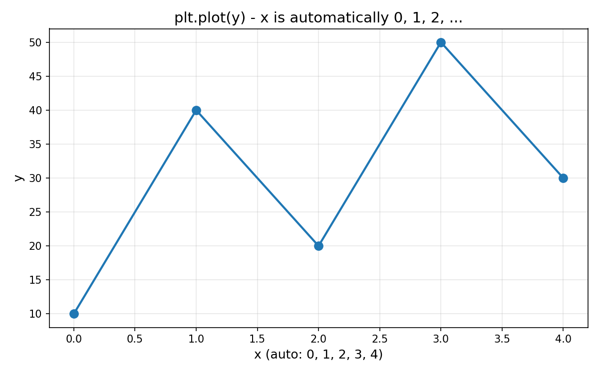
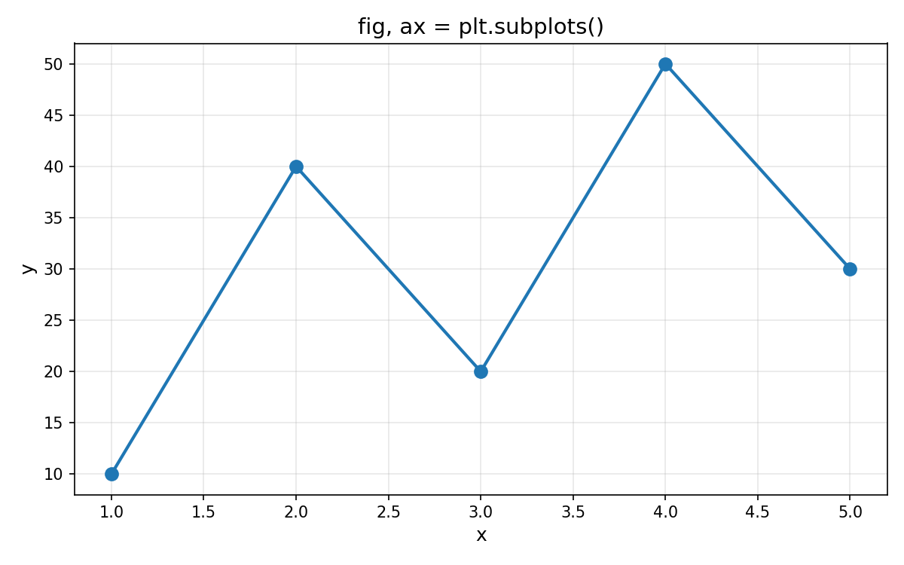
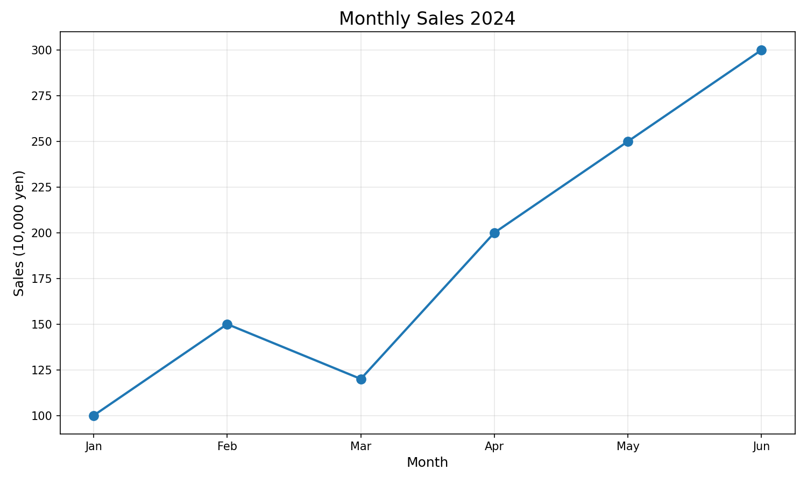

# Section1: Matplotlib の基本 - 技術説明

## 🎯 このセクションで学ぶこと

Matplotlib は Python で最も広く使われているグラフ描画ライブラリです。
データを視覚化することで、数字だけでは見えにくいパターンや傾向を発見できます。

---

## 1. Matplotlib とは

### なぜデータを可視化するのか

```
【数値だけ vs グラフ】

  数値だけのデータ                    グラフにすると...
  ┌───────┬──────┐
  │ index │ 売上 │                    売上
  ├───────┼──────┤                      ^
  │   1月 │ 100  │                  300 |           *
  │   2月 │ 150  │                  250 |        *
  │   3月 │ 120  │       ───→      200 |
  │   4月 │ 200  │                  150 |  *  *
  │   5月 │ 250  │                  100 |*       *
  │   6月 │ 300  │                      +-------------------> 月
  └───────┴──────┘                       1月 2月 3月 4月 5月 6月

┌──────────────────────────────────────────────────────┐
│ グラフにすると「右肩上がり」が一目で分かる！         │
│ → データの傾向やパターンを素早く理解できる          │
└──────────────────────────────────────────────────────┘
```

### Matplotlib のインポート

```python
# 標準的なインポート方法
import matplotlib.pyplot as plt

# Jupyter Notebook で使う場合
%matplotlib inline

# 日本語表示のため（オプション）
# pip install japanize-matplotlib
import japanize_matplotlib
```

---

## 2. 最初のグラフを描く

### plt.plot() の基本

x と y のデータを渡すだけで、簡単に折れ線グラフを描けます。
各点が線でつながれ、データの変化が可視化されます。


```python
import matplotlib.pyplot as plt

# データ
x = [1, 2, 3, 4, 5]
y = [10, 40, 20, 50, 30]

# グラフを描画
plt.plot(x, y)

# グラフを表示
plt.show()
```

### y データだけを渡す場合

```python
import matplotlib.pyplot as plt

# y データだけを渡すと、x は自動的に 0, 1, 2, ... になる
y = [10, 40, 20, 50, 30]
plt.plot(y)
plt.show()
```

y データだけを渡すと、x 軸は自動的に 0, 1, 2, ... のインデックスになります。



---

## 3. Figure と Axes の概念

### グラフの構造

```
【Figure と Axes の関係】

┌─────────────────────────────────────────────────────┐
│  Figure（図全体 = キャンバス）                      │
│                                                     │
│   ┌─────────────────────────────────────────────┐   │
│   │  Axes（グラフ領域）                         │   │
│   │                                             │   │
│   │      ^  y軸                                 │   │
│   │      |                                      │   │
│   │      |    *     *                           │   │
│   │      | *     *     *                        │   │
│   │      +-------------------> x軸              │   │
│   │                                             │   │
│   └─────────────────────────────────────────────┘   │
│                                                     │
└─────────────────────────────────────────────────────┘

  Figure: 1つ以上の Axes を含む「紙」のようなもの
  Axes  : 実際にグラフが描かれる「領域」
```

### 明示的に Figure と Axes を作成

```python
import matplotlib.pyplot as plt

# Figure と Axes を明示的に作成
fig, ax = plt.subplots()

# Axes にプロット
x = [1, 2, 3, 4, 5]
y = [10, 40, 20, 50, 30]
ax.plot(x, y)

plt.show()
```

`fig, ax = plt.subplots()` で Figure と Axes を明示的に作成します。
この方法では、`ax.plot()` のように Axes オブジェクトに対して操作します。



### 2つの書き方

```python
# 方法1: plt を直接使う（シンプル）
import matplotlib.pyplot as plt

plt.plot([1, 2, 3], [10, 20, 30])
plt.title("Simple Plot")
plt.show()

# 方法2: fig, ax を使う（より細かい制御が可能）
import matplotlib.pyplot as plt

fig, ax = plt.subplots()
ax.plot([1, 2, 3], [10, 20, 30])
ax.set_title("Using Axes")
plt.show()
```

```
【2つの書き方の比較】

┌──────────────────────┬──────────────────────┐
│ plt.xxx() 方式       │ ax.xxx() 方式        │
├──────────────────────┼──────────────────────┤
│ plt.plot(x, y)       │ ax.plot(x, y)        │
│ plt.title("...")     │ ax.set_title("...")  │
│ plt.xlabel("...")    │ ax.set_xlabel("...") │
├──────────────────────┼──────────────────────┤
│ シンプルで簡単       │ 複数グラフに便利     │
│ 初心者向け           │ 細かい制御が可能     │
└──────────────────────┴──────────────────────┘
```

---

## 4. グラフにタイトルとラベルを追加

### 基本的な装飾

```
【グラフの各要素】

                    タイトル
                       ↓
        ┌──────────────────────────────────┐
        │          月別売上推移            │
        │   y軸ラベル                      │
        │      ↓                          │
        │  売  ^ 300|           *          │
        │  上  |    |        *             │
        │  （  | 200|     *                │
        │  万  | 100|  *                   │
        │  円  |    +------------------→  │
        │  ）  |    1月 2月 3月 4月        │
        │      |         ↑                │
        └──────────────────────────────────┘
                    x軸ラベル
```

```python
import matplotlib.pyplot as plt

# データ
months = [1, 2, 3, 4, 5, 6]
sales = [100, 150, 120, 200, 250, 300]

# グラフを描画
plt.plot(months, sales)

# タイトルとラベルを追加
plt.title("Monthly Sales")      # タイトル
plt.xlabel("Month")             # x軸ラベル
plt.ylabel("Sales (10,000 yen)")  # y軸ラベル

plt.show()
```

### 日本語を使う

```python
import matplotlib.pyplot as plt
import japanize_matplotlib  # 日本語対応

months = [1, 2, 3, 4, 5, 6]
sales = [100, 150, 120, 200, 250, 300]

plt.plot(months, sales)
plt.title("月別売上推移")
plt.xlabel("月")
plt.ylabel("売上（万円）")

plt.show()
```

---

## 5. 複数の線を描く

### 同じグラフに複数の線

`plt.plot()` を複数回呼び出すことで、同じグラフに複数の線を重ねて表示できます。
`label` を指定して `plt.legend()` を呼ぶと、凡例が表示されます。


```python
import matplotlib.pyplot as plt

months = [1, 2, 3, 4, 5]
sales_2023 = [100, 120, 150, 180, 200]
sales_2024 = [120, 150, 200, 250, 300]

# 2つの線を描画
plt.plot(months, sales_2023, label="2023年")
plt.plot(months, sales_2024, label="2024年")

# 凡例を表示
plt.legend()

plt.title("年別売上比較")
plt.xlabel("月")
plt.ylabel("売上")

plt.show()
```

---

## 6. グラフの保存

### savefig() で画像として保存

```python
import matplotlib.pyplot as plt

x = [1, 2, 3, 4, 5]
y = [10, 40, 20, 50, 30]

plt.plot(x, y)
plt.title("Sample Graph")

# PNG形式で保存
plt.savefig("my_graph.png")

# 高解像度で保存（dpi = dots per inch）
plt.savefig("my_graph_hd.png", dpi=300)

plt.show()
```

```
【保存形式】

┌──────────┬──────────────────────────────┐
│ 形式     │ 用途                         │
├──────────┼──────────────────────────────┤
│ PNG      │ Web、一般的な画像            │
│ PDF      │ 印刷、ベクター形式           │
│ SVG      │ Web、拡大しても劣化しない    │
│ JPEG     │ 写真向け（グラフには不向き） │
└──────────┴──────────────────────────────┘
```

---

## 7. 実践：簡単な売上グラフ

### 完全な例

```python
import matplotlib.pyplot as plt

# 日本語を使う場合はこれを追加
# import japanize_matplotlib

# データ
months = ["Jan", "Feb", "Mar", "Apr", "May", "Jun"]
sales = [100, 150, 120, 200, 250, 300]

# Figure のサイズを指定
plt.figure(figsize=(10, 6))

# 折れ線グラフを描画
plt.plot(months, sales, marker='o')  # marker='o' で点を追加

# 装飾
plt.title("Monthly Sales 2024", fontsize=16)
plt.xlabel("Month", fontsize=12)
plt.ylabel("Sales (10,000 yen)", fontsize=12)
plt.grid(True)  # グリッド線を追加

# 保存して表示
plt.savefig("sales_2024.png", dpi=150)
plt.show()
```

**出力イメージ:**

上記のコードで生成されるグラフの例です。
タイトル、軸ラベル、マーカー、グリッド線などが設定されています。



---

## ✅ このセクションで学んだこと

1. **import matplotlib.pyplot as plt**: Matplotlib の標準的なインポート
2. **plt.plot(x, y)**: 折れ線グラフの基本
3. **Figure と Axes**: グラフの構造を理解
4. **plt.title(), xlabel(), ylabel()**: タイトルとラベル
5. **plt.legend()**: 複数の線に凡例を追加
6. **plt.savefig()**: グラフを画像として保存
7. **plt.show()**: グラフを表示

---

## 🔗 次のセクション

次は「Section2: 折れ線グラフと散布図」で、
より詳細なグラフのカスタマイズを学びます！
